# Spec Kit との差異

| 項目 | 内容 |
|------|------|
| 作成日 | 2026-08-14 |
| 最終更新 | 2026-08-16 |
| 比較対象 | GitHub **Spec Kit**（**v0.16.4** — 2026-08-16 時点の最新） |
| 自前側 | **claude-dev-harness**（harness-core **0.6.4** / harness-nextjs 0.3.1 / harness-unity 0.2.1 / harness-wpf 0.2.0） |
| 結論 | **本体は導入せず、概念のみ取り込み済み**（2026-08-14 決定・**維持**） |

> ### この文書の2つの層
>
> | 層 | 扱い |
> |----|------|
> | **採否の決定と、その理由** | **2026-08-14 の意思決定記録。書き換えない** |
> | **両者の差異の記載** | **現行版に追従する。** 比較表が古いと採否を再検討する材料にならないため |
>
> ⚠️ **Spec Kit 側はリリース間隔が1〜3日で破壊的変更が入る。**
> 本書の Spec Kit 側の記述は **v0.16.3 での実機検証**が土台で、**v0.16.4 までは版を追ったのみ**である
> （0.16.3 → 0.16.4 は patch で、本書の比較に影響する構造変化は無い）。
> **数か月後に参照する場合は再検証すること** — コマンド体系・Claude 統合形式・
> 公式プラグイン不提供方針・既知 issue の現状。
>
> > 直近の実績: **v0.16.0（2026-08-05）→ v0.16.4（2026-08-14）の9日間で5リリース。**
> > うち 0.16.0 には破壊的変更（Copilot 統合の既定を command から skill へ変更）が入っている。
> > **「1〜3日間隔・破壊的変更あり」という本書の前提は、この期間でも成り立っている。**

## ◎ 結論

**両者は「同じ思想の別実装」だが、カバーする区間が違う。**

- Spec Kit は **要求 → 実装** までを、あらゆる AI エージェント向けに手厚く整備したツールキット
- 統合ハーネスは **要求 → 実装 → 動作確認 → 実態設計書の維持** までを、Claude Code に特化して回す仕組み

**Spec Kit は「作るまで」、ハーネスは「作ったあとも」に強い。**

| 論点 | GitHub Spec Kit | 統合ハーネス |
|------|----------------|------------|
| 正体 | 仕様駆動開発（SDD）のツールキット。CLI `specify` が成果物テンプレートとコマンド群を配る | Claude Code の開発ハーネス。skills / agents / hooks をプラグインとして配る |
| 対象エージェント | **エージェント非依存**（Claude / Copilot / Gemini / Cursor 等） | **Claude Code 専用** |
| 強い区間 | 要求定義 → 仕様 → 計画 → タスク → 実装 | 左記 **＋ 動作確認 → コードレビュー → 実態設計書の同期維持** |
| 規模適応 | 2経路を**人間が選ぶ**（自動判定なし） | **S/M/L を AI が推測 → ユーザー承認**。フローが自動で変わる |
| 自動ゲート | なし（コマンドを人間が順に叩く） | **hooks** がコミット前ビルド・設計書同期を機械的に強制 |
| 実装後の世界 | 仕様は `specs/` に残るが、**実態を映す設計書は無い** | `docs/設計書/` ＋ `.doc-sync.md` 台帳で**コードと文書の同期を維持** |
| エコシステム | **約120k stars / 240+ contributors**。1〜3日間隔でリリース | **個人メンテ**。実運用は複数プロジェクトへ広がったが**依然として個人の範囲** |
| カスタマイズ | **体系化されている**（overrides / presets / extensions / bundles） | 機構としては無い（テンプレート層の上書き保護のみ） |
| 日本語 | 英語ベース。ローカライズは preset で自作 | **最初から日本語** |

> **採否の結論（2026-08-14 決定）**
>
> **Spec Kit 本体は導入しない。** 思想と成果物構造の有用な概念
> （constitution / clarify / checklist / analyze / converge / タスク3層化）は
> **すでに harness-core へ移植済み**。詳細は [01_統合前後の差異.md の Spec Kit 節](01_統合前後の差異.md#s-spec-kit-を取り入れたことによる違い)。

## 1. 立ち位置の違い

同じ「仕様を先に固めてから作る」思想だが、**解こうとしている問題が違う**。

| Spec Kit（標準化と汎用性） | 統合ハーネス（運用の自動化と継続性） |
|--------------------------|--------------------------------|
| 解く問題: **「AI に何を作らせるかを、チームで共有できる形にする」** | 解く問題: **「AI との開発を、破綻せず継続的に回し続ける」** |
| どのコーディングエージェントでも同じプロセスが回るようにする（agent-agnostic が設計原則） | Claude Code に特化し、**プラットフォーム機能（skills / agents / hooks / plugins）を使い切る** |
| 成果物（spec / plan / tasks）を**ファイルとして残し、レビュー可能にする**ことが中心 | 成果物を残すだけでなく、**コードと文書が乖離しないことを機械的に検査する** |
| プロセスの実行は**人間がコマンドを順に叩く**ことで進む | プロセスの実行は **hooks とスキルが半自動で進める**（人間は承認ゲートに集中） |
| カスタマイズは各自が preset / extension で行う前提 | カスタマイズは**設定契約（`harness.config.json`）で環境差を吸収**する設計 |

> **この差が最もよく出る質問**
>
> 「実装が終わって3か月後、コードと設計書がズレていることに誰が気づくか？」
>
> Spec Kit の答えは `/speckit.converge`（人間が思い出して叩く）。
> ハーネスの答えは **post-commit hook が指摘 → `update-docs` → `.doc-sync.md` 台帳 →
> push 前に `pre-push-check` が全コミットの記録を検証**。

## 2. 開発ライフサイクルのカバー範囲

**この資料で最も重要な表。どの段階を、どちらがどこまで持っているか。**

凡例: **●** 専用の仕組みがある / **◐** 部分的・付随的 / **—** 無い

| ライフサイクル段階 | SK | Spec Kit の実現手段 | HN | ハーネスの実現手段 |
|-----------------|----|-------------------|----|------------------|
| プロジェクト原則 | ● | `/speckit.constitution` → `.specify/memory/constitution.md` | ● | `constitution.md`（変更にユーザー承認必須・原則の優先順位を明記） |
| **設計方針の蓄積** | — | 無い。機能ごとの `plan.md` に閉じ、**横断する設計判断の置き場が無い** | ● | `.claude/01_development_docs/` 等（`projectDocs.policy`）。**Stage 2 が既存方針との整合を検査**し、新たな判断は `complete-feature` が**書き戻しを強制**する |
| **要件・ドメイン知識** | ◐ | `spec.md` に都度書く（機能をまたぐ知識の置き場は無い） | ● | `.claude/00_project/`（`projectDocs.requirements`）。**Stage 1 の入力**として読む |
| **規模判定** | — | 無い。shorter / full の2経路を**人間が選ぶ** | ● | **S/M/L を AI が推測 → ユーザー承認**。5軸基準・UX変更は自動 L・スコープ拡大時の再判定 |
| 要求・仕様（WHAT） | ● | `/speckit.specify` → `spec.md`（ユーザーストーリー） | ● | `new-feature` → 設計書 **Stage 1**（機能・画面設計） |
| 曖昧さの解消 | ● | `/speckit.clarify`（plan 前推奨・複数回可） | ● | `new-feature` Step 2。`[NEEDS CLARIFICATION]` ＋ §3-3 未解決事項表に回答を記録 |
| 受け入れ基準 | ● | `/speckit.checklist` → `checklists/`（オンデマンド生成） | ● | 設計書 §3-2 に常設。**未チェックなら完了処理をしない**と constitution で原則化 |
| 技術設計（HOW） | ● | `/speckit.plan` → `plan.md` / `research.md` / `data-model.md` / `contracts/` | ● | 設計書 **Stage 2**（変更ファイル / IF仕様 / データ構造 / 内部設計） |
| **設計レビュー** | ◐ | `/speckit.analyze` は**整合検査のみ**。設計の良し悪しは見ない | ● | `design-review` が **code-reviewer + 体験系アドバイザーを並列起動**。Stage 1/2 で観点を切り替え。結果を `docs/reviews/` に保存 |
| 整合検査（トレーサビリティ） | ● | `/speckit.analyze`（read-only） | ● | `design-review` Step 3。要求→設計→タスクの反映漏れを対応表で提示 |
| タスク分解 | ● | `/speckit.tasks` → `tasks.md`（Setup / Foundational / user-story / Polish の依存順・並列マーカー） | ◐ | 設計書 §2 のタスク一覧。**L 規模で依存順・並列可否を持たせる**が、生成の自動化は Spec Kit ほど作り込まれていない |
| Issue 連携 | ● | `/speckit.taskstoissues` で GitHub Issues 化 | — | 無い |
| 実装 | ● | `/speckit.implement`（依存順に実行・checklist をゲートとして読む） | ● | `coding-specialist` によるフェーズ単位の実装。段階的ビルド確認・一度に最大5ファイル等の規約 |
| **コミット前ゲート** | — | 無い（runtime hooks 機構はあるが標準の品質ゲートではない） | ● | **PreToolUse hook** が `git commit` を捕まえ、config の `gates.preCommit` を実行。失敗でブロック |
| **コードレビュー** | — | 無い | ● | `code-review` スキル＋ `code-reviewer` エージェント。設計書との突き合わせ・エラー処理・セキュリティ |
| **動作確認** | — | 無い | ● | 環境別モジュール: `browser-test`（Playwright MCP）/ `unity-verify`（Unity MCP・Play モード）/ `capture-screenshots`（UIAutomation） |
| 実装↔仕様の突合 | ● | `/speckit.converge`（残作業を `tasks.md` に追記） | ● | `sync-check` Step 3（converge）。**提示してから追記**（黙って書き換えない） |
| **実態設計書の維持** | — | **無い。** `specs/` は「作る前に書いた仕様」であり、実装後の実態を映す文書ではない | ● | `docs/設計書/`（API一覧 / ER図 / コンポーネント一覧…）を `update-docs` と `sync-check` の二層で維持 |
| **同期の証跡** | — | 無い | ● | `.doc-sync.md` 台帳にコミットハッシュ単位で記録。**`pre-push-check` が未記録コミットを検出して push を止める** |
| バグ修正の専用経路 | ● | `bug` 拡張: `bug.assess` → `bug.fix` → `bug.test` | ◐ | 専用経路は無いが、**規模判定で自然に S/M の軽量フローへ落ちる**。原因確定前の修正禁止・2回失敗で `/clear` から最小再現 等の原則あり |
| セッション文脈の保全 | — | 無い | ● | **SessionStart**（文脈注入）/ **PreCompact**（コンパクト跨ぎの退避）/ **SubagentStop**（差分提示） |
| 完了報告 | — | 無い | ● | `done` スキルが固定テーブル形式で出力 |
| **成果物の文章品質** | — | 無い | ● | `proofread-ja` ＋ `japanese-proofreader`（0.4.0）。**成果物のほぼ全量が AI の書いた日本語**で、しかも長期間残って後から読む人の判断材料になるため、**「校正」ではなく品質ゲート**として置いている |
| **ハーネス自身の更新** | ◐ | `specify integration upgrade`（ローカル改変は保護される） | ● | `plugin-update`（プラグイン層・0.6.2）＋ `harness-update`（テンプレート層の3点比較）の**2経路**。層で配信経路が違うため2本ある |

> **この表の読み方**
>
> 上半分（原則〜実装）は**ほぼ互角**。Spec Kit の方が成果物の作り込みは厚い。
> 差が出るのは**下半分** — コミット前ゲート / コードレビュー / 動作確認 / 実態設計書 / 同期の証跡 / セッション文脈。
> ここは Spec Kit が**設計思想として持っていない領域**
> （agent-agnostic を貫くため、特定エージェントの hooks 等に依存できない）。

## 3. フローの対比 — 1機能を作り切るまで

同じ「機能を1本作る」作業で、**何を何回叩き、どこで止まり、何が勝手に走るか**。
§2 が「持っているか」の比較なら、ここは「どう動くか」の比較。

**塗り分けは「誰が起動するか」**: 🟠 人（人間の明示操作）/ 🔵 AI（Claude が手順書に従って実行）/ 🟢 自動（hooks がランタイム発火）

```mermaid
flowchart LR
    subgraph SK["Spec Kit（full path）"]
        direction TB
        S0["/speckit.constitution<br/>初回のみ"]
        S1["/speckit.specify<br/>必須"]
        S2["/speckit.clarify<br/>任意・複数回可"]
        S3["/speckit.plan"]
        S4["/speckit.checklist<br/>任意"]
        S5["/speckit.tasks"]
        S6["/speckit.analyze<br/>任意・read-only"]
        S7["/speckit.implement"]
        S8["/speckit.converge"]
        S0 --> S1 --> S2 --> S3 --> S4 --> S5 --> S6 --> S7 --> S8
    end

    subgraph HN["統合ハーネス（L 規模）"]
        direction TB
        H0["/harness-core:new-feature"]
        H1{"規模判定を承認"}
        H2["曖昧さの解消 → Stage 1 設計"]
        H3["/harness-core:design-review feature"]
        H4{"Stage 1 を承認"}
        H5["Stage 2 設計"]
        H6["/harness-core:design-review tech"]
        H7{"Stage 2 を承認"}
        H8["実装（coding-specialist）"]
        H9["/harness-core:code-review"]
        H10["環境別の動作確認<br/>browser-test / unity-verify / capture-screenshots"]
        H11["/harness-core:build-check"]
        H12["/harness-core:update-docs"]
        H13["git commit"]
        H14["コミット前ゲート<br/>PreToolUse hook"]
        H15["設計書同期の通知<br/>PostToolUse hook"]
        H16["/harness-core:done"]
        H0 --> H1 --> H2 --> H3 --> H4 --> H5 --> H6 --> H7 --> H8
        H8 --> H9 --> H10 --> H11 --> H12 --> H13 --> H14 --> H15 --> H16
    end

    classDef human fill:#fde68a,stroke:#b45309,color:#1b1f24
    classDef ai fill:#bfdbfe,stroke:#1d4ed8,color:#1b1f24
    classDef auto fill:#bbf7d0,stroke:#15803d,color:#1b1f24

    class S0,S1,S2,S3,S4,S5,S6,S7,S8 human
    class H1,H4,H7 human
    class H0,H2,H3,H5,H6,H8,H9,H10,H11,H12,H13,H16 ai
    class H14,H15 auto
```



| | Spec Kit | 統合ハーネス |
|--|---------|------------|
| 起動の担い手 | **9コマンドすべてを人間が叩く。** 叩かなければ何も起きない | 入口は **1つだけ**（`new-feature`）。規模で**フローが自動的に変わる** |
| 規模への対応 | 小規模なら `specify → plan → tasks → implement → converge` の **shorter path** を**人間が選ぶ** | **AI が推測 → 人間が承認**。S 規模なら「実装 → build-check → コミット → done」まで縮む |
| 順序を知っているのは | **人間の記憶とドキュメント** | **CLAUDE.md と各スキルの手順書**（人間の記憶ではない） |
| 人が止まる場所 | 明示的な承認ゲートは無い | **規模判定 / Stage 1 / Stage 2** の3点（🟠） |
| 人もAIも介さず走るもの | 無い | コミット前後の **hooks**（🟢） |

> **最大の違い: フローの制御をどこに置いているか。**
>
> Spec Kit は**人間の入力**に置く（叩かなければ進まない／順序も人間が保つ）。
> ハーネスは**ドキュメントと hooks** に置く（次の手順は Claude が知っており、忘れたらフックが捕まえる）。
> この差が「叩き忘れたときに何が起きるか」に直結する。

### 段階ごとの対応

| 段階 | Spec Kit | 誰が | 統合ハーネス | 誰が |
|------|---------|------|------------|------|
| 入口 | 経路（full / shorter）を**人間が選ぶ**。自動判定は無い | 人 | `new-feature` 1本。**AI が S/M/L を推測 → 人間が承認** | AI＋人 |
| 要求定義 | `/speckit.specify` → `spec.md` | 人 | 設計書 Stage 1（機能・画面設計） | AI |
| 曖昧さの解消 | `/speckit.clarify` を**思い出して叩く**（任意・複数回） | 人 | `new-feature` Step 2 に**組み込み**。選択式で質問し §3-3 に回答を残す | AI |
| 設計レビュー | `/speckit.analyze` は**整合検査のみ**。設計の良し悪しは見ない | 人 | `design-review` が**サブエージェントを並列起動**し観点別にレビュー | AI |
| 承認ゲート | 明示的なゲートは無い（`implement` が checklist の未チェックを読むのみ） | — | **規模判定 / Stage 1 / Stage 2** の3点で必ず止まり、人間の承認を待つ | 人 |
| タスク分解 | `/speckit.tasks` → 依存順・並列マーカー付き `tasks.md` | 人 | 設計書 §2 のタスク一覧（L 規模で依存順を持たせる） | AI |
| 実装 | `/speckit.implement`（依存順に実行） | 人 | `coding-specialist` がフェーズ単位で実装 | AI |
| コードレビュー | **工程が無い** | — | `code-review`（設計書との突合・エラー処理・セキュリティ） | AI |
| 動作確認 | **工程が無い** | — | `browser-test` / `unity-verify` / `capture-screenshots` | AI |
| コミット前 | **ゲートが無い**。壊れていてもコミットできる | — | PreToolUse hook が `git commit` を捕まえ `gates.preCommit` を実行。**失敗でブロック** | **自動** |
| コミット後 | — | — | PostToolUse hook が変更を解析し**設計書更新の必要を通知** | **自動** |
| 実装↔仕様の突合 | `/speckit.converge` を**思い出して叩く** | 人 | `update-docs`（変更駆動）＋ `sync-check`（全量照合）の二層 | AI |
| 完了 | 工程が無い（`specs/` はそのまま残る） | — | `complete-feature` が**受け入れ基準の未チェック**と**設計方針への未反映**を見て完了を拒否 → `done` で報告 | AI |
| push 前 | 工程が無い | — | `pre-push-check` が**台帳に未記録のコミットを検出して止める** | AI |
| セッション跨ぎ | 工程が無い | — | SessionStart で文脈注入 / PreCompact で退避 | **自動** |

### 「叩き忘れた」ときに何が起きるか

フロー設計の差が最も実害として出る場面。

| 忘れたもの | Spec Kit | 統合ハーネス |
|-----------|---------|------------|
| 整合チェック | `analyze` を叩かなければ**何も検査されない**まま実装へ進む | `design-review` がフローの一部。Stage 1/2 の承認前に必ず通る |
| ビルド確認 | 壊れたままコミットできる | **コミットが物理的にブロックされる**（Claude も強行できない） |
| 文書の同期 | `converge` を忘れれば**乖離は放置**。3か月後に誰も気づかない | commit 後に hook が指摘 → 台帳に未記録なら **push が止まる** |
| 受け入れ基準 | checklist は任意生成。作らなければゲートも無い | 設計書 §3-2 に常設。**未チェックなら完了処理をしない** |

> **フェアに書くと — Spec Kit の方が良い点**
>
> ① **各コマンドが独立していて冪等**なので、途中から再開しやすく、部分的にやり直せる。
> ハーネスは連鎖する分「今どこにいるか」が設計書のステータス絵文字頼みになる。
> ② **タスク分解の作り込みが厚い**（Setup / Foundational / user-story / Polish のフェーズ分類、依存順、並列マーカー）。
> ③ **叩かないと進まない**ことは裏返せば**暴走しない**ということでもある。

> **この比較の前提**
>
> ハーネス側は **M / L 規模**のフロー。**S 規模では「実装 → build-check → コミット → done」まで縮む**ため、
> Spec Kit の shorter path よりさらに軽い。
> 逆に言えば、この図の重厚さは**規模判定が L と出た場合の姿**であり、常にこれが走るわけではない。

## 4. コマンド／スキルの対応表

| Spec Kit | 区分 | ハーネスの対応物 | 関係 |
|---------|------|----------------|------|
| `/speckit.constitution` | コア | `constitution.md`（テンプレート層） | **概念を取り込み済み**。ハーネス側は生成コマンドではなく、テンプレートとして最初から置かれる |
| `/speckit.specify` | 必須 | `/harness-core:new-feature` ＋ 設計書 Stage 1 | ほぼ同等。ハーネスは**1ファイルに集約**、Spec Kit は `spec.md` として分離 |
| `/speckit.clarify` | 任意ゲート | `new-feature` Step 2 | **概念を取り込み済み**。`[NEEDS CLARIFICATION]` マーカーも同じ |
| `/speckit.plan` | コア | 設計書 Stage 2 ＋ 承認ゲート | ハーネスは**承認ゲートが明示的**。Spec Kit は成果物の種類が多い（research / data-model / contracts） |
| `/speckit.checklist` | 任意ゲート | 設計書 §3-2 ＋ `complete-feature` | **概念を取り込み済み**。ハーネスは**常設**（オンデマンド生成ではない） |
| `/speckit.tasks` | コア | 設計書 §2 タスク一覧 | Spec Kit の方が**作り込みが厚い**（フェーズ分類・依存順・並列マーカーの自動生成） |
| `/speckit.analyze` | 任意ゲート | `design-review` Step 3 | **概念を取り込み済み**。ハーネスは**設計の質のレビューと同居** |
| `/speckit.implement` | コア | `coding-specialist` ＋ フェーズ実装 | ハーネスは **hooks によるコミット前ゲート**が付く |
| `/speckit.converge` | 新規 | `sync-check` Step 3 | **概念を取り込み済み**。ハーネスは**実態設計書との突合まで含む**ため範囲が広い |
| `/speckit.taskstoissues` | 新規 | — 対応物なし | **Spec Kit のみ** |
| `bug.assess / fix / test` | 拡張 | ◐ 規模判定 S/M | Spec Kit は専用経路、ハーネスは既存フローの軽量分岐で処理 |
| `specify integration upgrade` | CLI | `plugin-update` ＋ `harness-update` | 役割は同じ（**ハーネス自身の更新**）。ハーネスは**層ごとに配信経路が違う**ため2本に分かれる |
| — 対応物なし | — | `build-check` / `code-review` / `browser-test`・`unity-verify`・`capture-screenshots` / `update-docs` / `sync-check` / `complete-feature` / `pre-push-check` / `done` / `proofread-ja` | **ハーネスのみ**（実装後〜運用の区間） |

## 5. 成果物の構造

同じ情報を、片方は**複数ファイルに分散**し、片方は**1ファイルに集約**する。

**Spec Kit — 機能ごとにディレクトリ**:

```
.specify/
├ memory/constitution.md      プロジェクト原則
├ scripts/{ps,sh,py}/         補助スクリプト6本
├ templates/                  spec/plan/tasks/checklist
├ workflows/                  workflow.yml
└ feature.json                アクティブ機能のポインタ
                              (gitignore・マシンローカル)

specs/001-feature-slug/       ← リポジトリルート直下
├ spec.md                     要求・ユーザーストーリー
├ plan.md                     技術計画
├ research.md / data-model.md
├ quickstart.md / contracts/
├ tasks.md                    依存順タスク
└ checklists/                 品質チェックリスト
```

- 機能番号は `001-` の三桁連番
- アクティブ機能は **git ブランチではなく `feature.json`** で判定
- **実装後の実態を映す文書は無い**

**統合ハーネス — 機能は1ファイル、実態は別軸**:

```
docs/
├ features/
│  ├ yyyymmdd_機能名.md          ← 1機能=1ファイル
│  │   1.概要 / 2.タスク一覧
│  │   3.機能・画面設計(Stage 1)
│  │     3-2.受け入れ基準チェックリスト
│  │     3-3.未解決事項
│  │   4.技術設計(Stage 2)
│  │   5.動作確認計画
│  ├ completed/  ← 完了後に自動振り分け
│  └ pending/    ← 保留
├ 設計書/          ★実装後の"生きた"設計書
│  ├ API一覧.md / ER図.md / …
│  └ .doc-sync.md  ★同期台帳(コミットハッシュ)
└ reviews/         レビュー結果の保存先

constitution.md    プロジェクト原則(ルート)
```

- 機能名は **日付＋機能名**（連番管理をしない）
- ステータス絵文字（🔵🟡✅⏸️❌）で進行を表す
- **`docs/設計書/` が Spec Kit に無い軸**

> **設計思想の違い**
>
> Spec Kit は**「工程ごとに成果物を分ける」** — レビュー単位が明確になり、工程の完了が可視化される。
> ハーネスは**「1機能の全情報を1ファイルに集約する」** — 文脈が1箇所にまとまり、
> AI に読ませる際のトークン効率と一貫性が上がる。
>
> **どちらが正しいかではなく、レビュー重視（分散）か、AI との対話重視（集約）かの選択。**

## 6. 規模適応 — 最大の設計差

Spec Kit 最大の批判点であり、ハーネスが明確に優位な唯一の構造的差分。

| Spec Kit — 人間が経路を選ぶ | 統合ハーネス — 入口で規模を判定する |
|--------------------------|--------------------------------|
| **shorter path**: specify → plan → tasks → implement → converge | **フローの入口に規模判定がある**（5軸基準表） |
| **full path**: constitution → specify → clarify → plan → checklist → tasks → analyze → implement → converge | **AI が推測 → ユーザーが承認**の2ステップ。AI 単独では確定しない |
| clarify / checklist / analyze は「品質ゲート」で、小規模なら省略してよいと公式に明記 | 迷ったら L 寄りに提示（AI バイアス補正）。**UX 変更を含めば自動的に L** |
| **ただし判断は人間。自動判定・自動スキップは無い** | 作業中のスコープ拡大に気づいたら**再判定**。破壊的変更・スキーマ変更が判明したら**即停止** |
| 冗長性批判への公式回答は「軽量モード追加」ではなく**「presets / extensions で各自カスタマイズせよ」** | フル形パイプラインは **L 規模のみ**（constitution 第1原則）。ただし**軽量な整合検査（analyze / converge 相当）は全規模に適用** |

> **Spec Kit への代表的批判（コミュニティ／2026年時点）**
>
> **Thoughtworks Technology Radar Vol.34（2026-04）はリング「Assess」**（Trial / Adopt ではない）。
> 指摘は "instruction bloat"（コンテキスト腐敗）、"unnecessary defensive checks and overly verbose
> markdown outputs"、価値を引き出せるのは経験豊富なエンジニア、というもの。
> ほかに「作業の幻覚」（大量テキストを生成するが実装品質が伴わない）、「変更よりも仕様の方が長い」、
> ウォーターフォールの再来、仕様レビュー＋実装レビューの**二重レビューコスト**。
>
> **ハーネスはこの批判を「自分に返ってこないよう」構造化した** — Spec Kit の概念を取り込む際、
> フル形の適用を L 規模に限定することを constitution の第1原則に置いている。

## 7. Spec Kit の方が優れている点

自前ハーネスを評価する以上、ここを正確に把握しておく必要がある。

| 項目 | Spec Kit | ハーネスの現状 |
|------|---------|--------------|
| **エージェント非依存** | Claude / Copilot / Gemini / Cursor など複数のエージェントで同じプロセスが回る。**これが設計原則**（公式 Claude プラグインを出さない理由でもある） | **Claude Code 専用**。プラグイン機構に強く依存しており、他エージェントへは移せない |
| **カスタマイズ機構** | 解決順 `overrides` → `presets` → `extensions` → コア既定。合成戦略 replace / prepend / append / **wrap**（`{CORE_TEMPLATE}` にコア版を差し込む）。`bundles` で配布単位化。`integration upgrade` はローカル改変を検知して上書きしない | 機構としては**無い**。テンプレート層の改変は `harness-update` が `project-local` として保護するのみ。「コアの挙動を保ったまま独自ルールで包む」ことはできない |
| **タスク生成の作り込み** | `tasks.md` を Setup / Foundational / user-story / Polish のフェーズに分け、**依存順と並列マーカーを自動生成** | 設計書 §2 のタスク一覧。L 規模で依存順を持たせる方針はあるが、**生成の自動化は弱い** |
| **Issue 連携** | `/speckit.taskstoissues` で GitHub Issues へ変換。チーム運用に直結 | **無い** |
| **バグ修正の専用経路** | `bug` 拡張の3段（assess / fix / test）。assess と test は read-only で、**fix だけがソースを変更する**という明快な分離 | 規模判定で S/M に落ちるだけ。**読み取り専用フェーズの分離は無い** |
| **エコシステム** | 約120k stars / 9.8k forks / **240+ contributors**。1〜3日間隔でリリース。事例・記事・議論が公開されている | **個人メンテ。** 実運用は複数プロジェクトへ広がったが、**外部の目は一度も入っていない** |
| **オンボーディング** | 第三者が**すでに知っている可能性がある**。公式ドキュメント・チュートリアルが整備 | ゼロから説明が必要。**ガイドは揃った**（入門 / 運用 / セットアップ / 移行 / 図6本）が、**読み手は今のところ書いた本人だけ**で、第三者に通用するかは未検証 |
| **スクリプトの多環境対応** | bash / powershell / python の3言語で**パリティ検証済み**（JSON 出力がバイト一致、CI が3OSで実行） | Node.js 単一。ただし**これは意図的な選択**（Windows／コンテナ両対応のため） |

> **最も重い差: バス係数**
>
> Spec Kit は 240+ contributors が支えている。統合ハーネスは**1人**である。
> 「作った本人が触れなくなったらどうなるか」という観点では、比較にならない差がある。
>
> **実運用の裏付けは「1プロジェクト・1周分」からは増えた**（複数プロジェクトでの継続運用、
> 既存プロジェクトの移行3本、版の追従2本）。ただし**増えたのは実測の本数であって、関わる人数ではない。**
> バス係数はいまも **1** のままで、ここは実測を積んでも動かない種類の差である。
>
> → 緩和策としては、ロジックの実体が素の skills / agents / hooks ファイルであること
> （プラグイン仕様が変わってもコピー配布へ退避可能）と、設計判断が `docs/` に文書として残っていることが挙げられる。

## 8. 統合ハーネスの方が優れている点

| 項目 | 統合ハーネス | Spec Kit の現状 |
|------|------------|---------------|
| **規模適応** | S/M/L を**入口で自動判定 → ユーザー承認**。フル形は L のみ | 2経路を人間が選ぶ。自動判定なし。**最大の批判点** |
| **実装後の生きた設計書** | `docs/設計書/`（API一覧 / ER図 / コンポーネント一覧 等）を**差分駆動（update-docs）と全量照合（sync-check）の二層**で維持 | **無い。** `specs/` は「作る前の仕様」であり、実装後の実態は追わない |
| **同期の機械的な証跡** | `.doc-sync.md` 台帳にコミットハッシュ単位で記録し、**`pre-push-check` が未記録コミットを検出して push を止める** | **無い** |
| **自動ゲート（hooks）** | コミット前ビルド／型チェック（失敗でブロック）、コミット後の設計書更新要否判定、編集後 lint、migrate 前バックアップ。**人間が思い出さなくても走る** | runtime hooks 機構は一級市民化されたが、**標準の品質ゲートとしては提供されない** |
| **レビューのエージェント編成** | code-reviewer / 体験系アドバイザー（product-advisor ⇔ game-designer）/ documentation-manager を**並列起動**し、結果を `docs/reviews/` に保存 | **無い。** `analyze` は整合検査のみで、設計の良し悪しは見ない |
| **動作確認の形式化** | 環境ごとに専用モジュール。**Playwright MCP / Unity MCP（Play モード）/ UIAutomation**。C1 では静的検査を全通過した実装から**本物の不具合を検出した** | **無い** |
| **セッション文脈の保全** | SessionStart（文脈注入）/ PreCompact（コンパクト跨ぎの退避）/ SubagentStop（差分提示） | **無い**（エージェント非依存のため、特定エージェントのライフサイクルに乗れない） |
| **環境非依存の実現方法** | `harness.config.json` という**設定契約**で、Next.js / Unity / WPF を**単一実装**で扱う。新環境の追加は8項目のチェックリスト | エージェント非依存ではあるが、**開発環境（言語・フレームワーク）の差は扱わない** |
| **日本語** | **最初から日本語**。設計書テンプレート・スキル・原則すべて | 英語ベース。ローカライズは preset で自作する想定（公式カタログに日本語 preset は無い） |
| **Windows 適性** | hooks は全て Node.js。**Python も WSL も不要**。Unity のドライブレター問題等の回避策も織り込み済み | Windows 対応は良好（PowerShell 既定・エンコーディング系バグは解消）だが、**生成スキルの OS 固有パスハードコード（未解決 issue）**があり、リポジトリ共有と相性が悪い（回避は `--script py`） |
| **配布形態** | Claude Code 公式の**プラグイン＋マーケットプレイス**。更新がプロジェクトへ配信される | **公式 Claude プラグインは存在せず、今後も出ない方針**。スキル直置きのため、更新は `specify` CLI 経由 |

> **要点**
>
> ハーネスの優位は**すべて「Claude Code に特化したから得られたもの」**（hooks / agents / plugins）と、
> **「作ったあとの世界を扱うと決めたから得られたもの」**（実態設計書 / 台帳 / 動作確認）に分類できる。
> 前者は Spec Kit が設計原則上、意図的に取らない選択であり、後者は Spec Kit がスコープに含めていない領域。
> **つまり優劣ではなく、スコープの違いが大半。**

## 9. 導入・配布・運用

| 観点 | Spec Kit | 統合ハーネス |
|------|---------|------------|
| 導入方法 | `uv tool install specify-cli`（または pipx / PyPI）→ `specify init --integration claude`。**init は完全オフライン** | `create-project.mjs` で生成 → `claude plugin install` ×2。**Python 不要** |
| Claude への統合形式 | `.claude/skills/speckit-*/SKILL.md` の**10ディレクトリを直置き**。コマンド形式へのフォールバックは無い | **プラグイン**。`/harness-core:*` と名前空間化され、プロジェクトのファイルを汚さない |
| 更新の届き方 | `specify integration upgrade`（ローカル改変は保護される） | プラグイン層は **`plugin-update`**（marketplace から配信・**版番号がトリガー**）／テンプレート層は **`harness-update`** の3点比較。どちらもローカル改変は保護される |
| プロジェクトへの痕跡 | `.specify/` ＋ `.claude/skills/speckit-*/` ＋ `specs/` が**コミット対象として残る** | ロジックは**プロジェクト外**（プラグイン）。残るのは `.claude/` の設定と `docs/` のみ |
| リリース頻度 | **1〜3日間隔**。2026年2月以降で55本以上。**破壊的変更あり** | 必要に応じて。semver ＋ CHANGELOG。**版固定 / autoUpdate を選べる** |
| カスタマイズの入口 | presets / extensions / bundles（**公式に厚くサポート**） | `harness.config.json`（環境差）＋ テンプレート層の直接編集（`project-local` として保護） |

## 10. 継続性のリスク比較

| Spec Kit を採用した場合のリスク | 自前ハーネスを続ける場合のリスク |
|-----------------------------|------------------------------|
| **追随コスト**: 1〜3日間隔のリリースに破壊的変更が混じる（実績: コマンドの名前空間化、Claude 統合のスキル形式移行、`--ai` フラグ廃止、constitution のスコープ変更） | **バス係数1**。作った本人しか全体像を把握していない |
| **公式 Claude プラグインが今後も出ない**（agent-agnostic 原則）。第三者製に頼ると依存が二重になる | **実績が偏っている**: 実測はすべて **nextjs・単独作業**。unity / wpf の既存プロジェクト移行とチーム利用は未検証 |
| **未解決 issue**: 生成スキル10本中9本が OS 固有のスクリプトパスをハードコード。コミットすると他 OS のチームメイト環境で壊れる | **Claude Code のプラグイン仕様変更**に影響される（比較的新しい機能） |
| **二重管理**: 既存の `docs/features/` と `specs/` で真実の所在が2つになる | **外部の知見が入ってこない**。批判・議論・改善が公開の場で回らない |
| メンテナ体制の変動歴あり | **未実測の領域が残る** — unity / wpf 環境の既存プロジェクト移行、チーム利用。実測はすべて nextjs・単独作業 |

> **緩和策**: ロジックの実体は素の skills / agents / hooks ファイルなので、
> プラグイン仕様が変わっても**テンプレート層へのコピー配布に退避できる**（構造は無駄にならない）。

## 11. 使い分けの指針

| 状況 | 推奨 |
|------|------|
| Claude Code で、Windows で、日本語で、1人〜少人数で開発する | **統合ハーネス**。すべての前提が噛み合っている |
| 実装後も設計書を維持したい／コードと文書の乖離を機械的に防ぎたい | **統合ハーネス**。Spec Kit にこの区間は無い |
| 小さな修正が多く、重いセレモニーを避けたい | **統合ハーネス**。規模判定がフローの入口にある |
| 複数のコーディングエージェント（Copilot / Gemini / Cursor 等）を併用する／するかもしれない | **Spec Kit**。エージェント非依存が設計原則 |
| チームで標準プロセスを共有したい／第三者の参加を見込む | **Spec Kit**。公開ドキュメントと知名度がそのまま資産になる |
| タスクを GitHub Issues として運用したい | **Spec Kit**（`taskstoissues`） |
| プロセス自体を製品として配布・カスタマイズさせたい | **Spec Kit**。presets / extensions / bundles が整備されている |

### もし将来 Spec Kit 本体を試すなら（パイロット指針）

- `--script py` を指定する（生成スキルの OS 固有パス問題を回避し、クロス OS 可搬にする）
- 独自テンプレートは **preset 化（`wrap` 戦略）**して `specify integration upgrade` の保護を受ける
- Claude Code へはコミュニティ製の統合か `specify init --integration claude`（スキル直置き）
- 日本語テンプレートは**文字化け検証ステップを組み込む**（エンコーディング系は修正済みだが CP932 環境での実測は未確認）
- **併用は L 規模1機能のパイロットに限定**し、`docs/features/` と `specs/` の二重管理を常態化させない

> **最終判断（2026-08-14 決定 / 2026-08-16 時点でも維持）**
>
> **Spec Kit 本体は導入しない。** 取り込む価値のある概念
> （constitution / clarify / checklist / analyze / converge / タスク3層化）は
> **すでに harness-core へ移植済み**で、その結果 **要求 → 設計 → タスク → 実装 → 実態設計書** の
> 全区間にトレーサビリティが通る状態になっている。これは Spec Kit 本体より**広いカバレッジ**である。
>
> 再検討すべきタイミングは **①複数エージェントを併用することになったとき
> ②チーム開発で標準プロセスの共有が必要になったとき**。
>
> **0.2.1 → 0.6.4 の間で、この判断を見直す材料は出ていない。**
> 増えた4スキル（`proofread-ja` / `plugin-update`）と設計方針層の復活は、いずれも
> **Spec Kit がスコープに含めていない「作ったあと」と「回し続ける」の区間**であり、
> **両者の差は縮むどころか広がっている**。
> 一方で ①② の条件はどちらも**まだ発生していない**（実測はすべて単独作業・Claude Code のみ）。

---

**出典**: Spec Kit の Web 調査＋Windows 実機検証（v0.16.4.dev0 をクローンし
`specify init --integration claude` で生成物を確認）、統合検討時の提案文書 §7（採否の判断）、
C1 実施記録（実運用の裏付け）、`claude-dev-harness` リポジトリの実装
（各 SKILL.md / hooks.json / harness.config.json / constitution.md）。

**時限情報の注意**:

| 側 | 鮮度 |
|----|------|
| **Spec Kit** | **実機検証は 2026-08-14（v0.16.4.dev0）のまま。** 版だけ v0.16.4 へ追った。機能比較の再検証はしていない |
| **ハーネス** | **2026-08-16 / harness-core 0.6.4** の実装に照合済み |

**したがって、この文書で最も先に腐るのは Spec Kit 側の列である。**
採否を再検討する場面では、まず Spec Kit 側を実機で取り直すこと。

関連資料: [01_統合前後の差異.md](01_統合前後の差異.md)（3テンプレート → 統合ハーネスの差分。Spec Kit 由来の変更点も収録）。

## 改訂履歴

| 版 | 日付 | 内容 |
|----|------|------|
| 1.0 | 2026-08-14 | 初版。Spec Kit v0.16.3 との比較と採否の判断（本体不採用・概念のみ取り込み） |
| 1.1 | 2026-08-15 | ライフサイクル比較表に「**設計方針の蓄積**」「**要件・ドメイン知識**」の2行を追加（harness-core 0.6.0 の設計方針層）。「完了」行に書き戻しゲートを追記 |
| 1.2 | 2026-08-16 | **差異の記載を現行版（harness-core 0.6.4 / Spec Kit v0.16.4）へ追従させた。** 冒頭に「決定は書き換えない / 差異は追従する」の2層を明示。§2 に「成果物の文章品質」「ハーネス自身の更新」の2行、§4 に `integration upgrade` の対応行を追加。**§7・§10 の「実績1プロジェクト・1周分」「入門ガイドは書き直し中」を実態へ訂正** — 実測は増えたが**すべて nextjs・単独作業**であり、**バス係数1 は動いていない**点を明示した。Spec Kit 側は実機検証を取り直しておらず、鮮度が両側で違うことを末尾に明記 |
