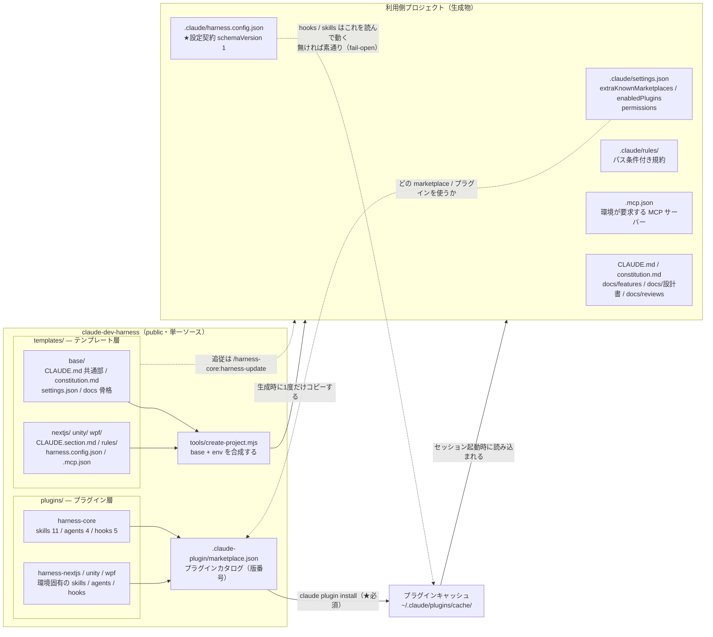

# 全体アーキテクチャ図 — 何がどこにあるか

| 項目 | 内容 |
|------|------|
| 対応ハーネス版 | harness-core 0.4.0 / harness-nextjs 0.2.0 / harness-unity 0.2.0 / harness-wpf 0.1.0 |
| 最終更新 | 2026-08-15 |

ハーネスを構成する要素が**どのリポジトリのどこにあり、利用側プロジェクトへどう配置されるか**を示す図。

**ポイント**:
- ハーネスは**2層**で配られる。**プラグイン層**（marketplace 経由で更新される）と**テンプレート層**（生成時に1度コピーされる）
- 両層を利用側で結ぶのが **`.claude/harness.config.json`**。core の hooks / skills は**すべてこれを読んで動き**、無ければ **fail-open で素通り**する
- この図は**静的な構造**（何がどこにあるか）。**変更が利用側へ伝わる流れ（時間軸）は [改善還元フロー図](06_改善還元フロー図.md)** を参照

## 図の構成

### アクター（6者）

| アクター | 役割 |
|---------|------|
| **claude-dev-harness** | 単一ソース（public）。`plugins/` と `templates/` と `tools/` を持つ |
| **marketplace `dev-harness`** | `.claude-plugin/marketplace.json`。**プラグインのカタログ＝配信の入口**。版番号もここに書かれる |
| **harness-core** | 環境非依存の本体。スキル11 / エージェント4 / フック5 |
| **環境プラグイン** | `harness-nextjs` / `harness-unity` / `harness-wpf`。core と**併用**する差分 |
| **プラグインキャッシュ** | `~/.claude/plugins/cache/...`。**実際に読まれる実体**で、セッション起動時に読み込まれる |
| **利用側プロジェクト** | `create-project.mjs` の生成物。`.claude/` + `CLAUDE.md` + `constitution.md` + `docs/` |

## 図

## 読み方

| 要素 | 意味 |
|------|------|
| `CORE` / `ENVP` → `MP` | プラグインは marketplace のカタログに載って初めて配信対象になる。**版番号もカタログ側に書く**（`plugin.json` と2箇所） |
| `MP` → `CACHE` | **`claude plugin install` が必須**。`enabledPlugins` の記述だけでは導入されない（実測） |
| `CACHE` → `PROJ` | 読まれるのはリポジトリではなく**キャッシュ**。だから更新後に再起動が要る |
| `TB` / `TE` → `TOOL` → `PROJ` | テンプレート層は**生成時の1回コピー**。以後はプロジェクトのファイルになる |
| `TEMPL` ⇢ `PROJ`（点線） | 生成後にテンプレートが良くなっても自動では届かない。**`/harness-core:harness-update`** の3点比較で追従する |
| `CFG` ⇢ `CACHE`（点線） | **依存の向きが逆**なのが要点。プラグインは環境を決め打たず、プロジェクト側の設定契約を読んで振る舞いを決める |
| `SET` ⇢ `MP`（点線） | どの marketplace を知っていて、どのプラグインを有効にするかは**プロジェクトの設定**が決める |

## 2層の違い（最重要）

| | プラグイン層 | テンプレート層 |
|--|------------|--------------|
| 実体の場所 | `plugins/harness-*/` | `templates/base` + `templates/<env>` |
| 利用側での置き場所 | **プロジェクト内に無い**（キャッシュ） | **プロジェクト内のファイル**になる |
| 版番号 | あり（semver） | なし |
| 更新の届き方 | `claude plugin update` → 再起動 | `/harness-core:harness-update`（3点比較） |
| ローカル改変 | できない（キャッシュを触らない） | **してよい**。`harness-update` が「保持」に分類する |

> 詳しい伝わり方は [改善還元フロー図](06_改善還元フロー図.md) を参照。ここでは**置き場所の違い**だけを押さえればよい。

## 中身の対応表

| プラグイン | スキル | エージェント | フック |
|-----------|--------|-------------|--------|
| `harness-core` | `new-feature` / `design-review` / `code-review` / `build-check` / `update-docs` / `sync-check` / `complete-feature` / `pre-push-check` / `done` / `harness-update` / `proofread-ja` | `coding-specialist` / `code-reviewer` / `documentation-manager` / `japanese-proofreader` | `session-start-context` / `pre-compact-save` / `pre-commit-check` / `post-commit-doc-check` / `subagent-stop-diff` |
| `harness-nextjs` | `browser-test` | `browser-tester` / `product-advisor` | `post-edit-lint` / `pre-migrate-backup` |
| `harness-unity` | `unity-verify` | `game-designer` | `pre-commit-cs-check` |
| `harness-wpf` | `capture-screenshots` | `product-advisor` | （なし） |

呼び出しは名前空間付き（`/harness-core:<name>` / `/harness-<env>:<name>`）。
各要素が**何を担当し誰が呼ぶか**は [役割比較図](03_役割比較図.md) を参照。

> 環境プラグインの hook は **core の `harness-lib.js` を require しない**。
> `${CLAUDE_PLUGIN_ROOT}` はプラグインごとに異なり、プラグイン間の参照が保証されないため、
> 各プラグインが最小ヘルパ（`hooks/scripts/plugin-lib.js`）を自前で持つ。**重複は意図的**。

## 直したいときどこを触るか

| 直したいもの | 触る場所 |
|------------|---------|
| スキルの手順・エージェントの指示・フックの挙動 | `plugins/harness-core/` または `plugins/harness-<env>/` |
| 全環境共通の `CLAUDE.md` / `constitution.md` / `docs` 骨格 | `templates/base/` |
| 環境固有の規約・`harness.config.json` の既定値・`.mcp.json` | `templates/<env>/` |
| 生成そのものの挙動（合成規則・プレースホルダ） | `tools/create-project.mjs` |

**`plugins/` 配下ならプラグイン層、`templates/` 配下ならテンプレート層。**
どちらを触ったかで、利用側への届き方が変わる（→ [改善還元フロー図](06_改善還元フロー図.md)）。
