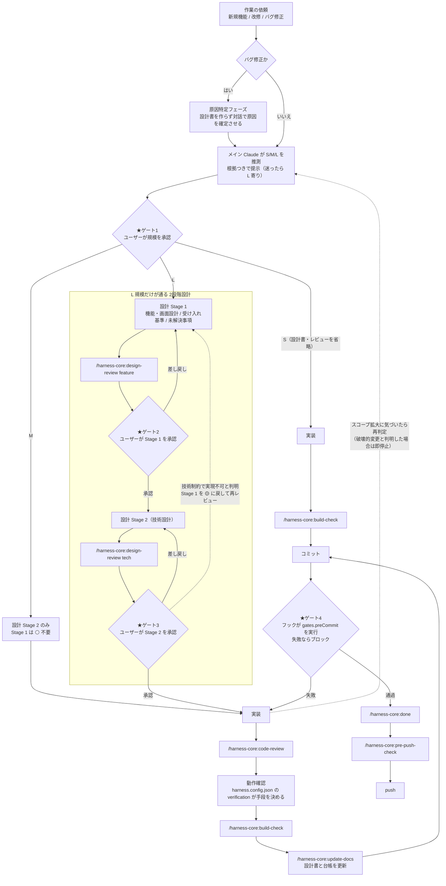

# 開発フロー図 — ゲートはどこにあるか

| 項目 | 内容 |
|------|------|
| 対応ハーネス版 | harness-core 0.2.3 / harness-nextjs 0.1.2 / harness-unity 0.2.0 / harness-wpf 0.1.0 |
| 最終更新 | 2026-08-15 |

規模判定から push までの流れを、**承認ゲートの位置**と**戻り経路**に絞って示す図。

**ポイント**:
- **止まる場所は4つ。** 規模の承認 / Stage 1 の承認 / Stage 2 の承認 / コミット時のフック。**このうち3つは人が判断する**
- **S 規模は設計書もレビューも通らない。** 経路そのものが短い。「全変更に重い手続きを課さない」のがこのハーネスの設計判断（規模ゲート原則）
- **前に進むだけの流れではない。** Stage 2 → Stage 1 の**戻り**と、実装中のスコープ拡大による**再判定**がある

> 各規模で使うスキルの**一覧**は `CLAUDE.md` の規模別フロー表に、判定基準（5軸）は
> `plugins/harness-core/skills/new-feature/開発フローと規模判定.md` にある。ここでは重複させない。

## 図の構成

### アクター（4者）

| アクター | 役割 |
|---------|------|
| **ユーザー** | 規模と設計を**承認する人**。3つのゲートはすべてここで止まる |
| **メイン Claude** | 規模を推測し、設計書を書き、実装し、スキルを進める |
| **スキル** | `/harness-core:*`。各工程の手順書 |
| **フック** | コミット時に `gates.preCommit` を自動実行する。**人の判断を介さない唯一のゲート** |

## 図

## 読み方

| 経路 | 意味 |
|------|------|
| 依頼 → バグ判定 → 原因特定 | **バグは症状で規模を決めない。** 原因を確定させてから判定する。原因特定フェーズは設計書を作らない |
| 推測 → ★ゲート1 | 規模判定は **AI が推測 → 人が承認**の2ステップ。AI は楽な方（S 寄り）に倒れやすいため、**迷ったら L 寄りで出す**のが規定 |
| ★ゲート1 → S | **S だけ経路が独立している。** 設計書・設計レビュー・コードレビュー・`update-docs` をすべて通らない |
| ★ゲート1 → M | M は **Stage 2 だけ**の1段階設計。Stage 1 は `⚪ 不要` と記録する |
| ★ゲート1 → L | L だけが2段階設計を通る。**UX 変更を含むものは自動的に L** |
| ★ゲート2 / ★ゲート3 | 設計レビューの結果を受けて**人が承認する**。差し戻しは同じ Stage をやり直す |
| ★ゲート3 ⇢ Stage 1（点線） | **戻り経路。** Stage 2 で技術的に実現不可と分かったら、Stage 1 のステータスを 🟡 に戻し、受け入れ基準や操作フローを直して `design-review feature` から再実行する |
| 実装 → code-review → 動作確認 | **動作確認はレビューの後**。手段は `harness.config.json` の `verification` が決める（環境ごとに違う） |
| ★ゲート4 | **唯一、人が介在しないゲート。** コミット時にフックが `gates.preCommit` を実行し、失敗すればコミットが通らない |
| 実装 ⇢ 推測（点線） | 途中でスコープが膨らんだら**再判定に戻る**。フェーズ実行中に気づいた場合は現フェーズを完了させてから提案する |

## 4つのゲート

| ゲート | 誰が判断するか | 通らないと | 省略できるか |
|-------|--------------|-----------|------------|
| **1. 規模の承認** | ユーザー | フローに入れない | ❌ 全規模で必須 |
| **2. Stage 1 の承認** | ユーザー | Stage 2 に進めない | L 規模のみ存在 |
| **3. Stage 2 の承認** | ユーザー | 実装に進めない | L 規模のみ存在 |
| **4. コミット前チェック** | **フック（自動）** | コミットできない | ❌ 条件が合えば必ず走る。ただし config 不在時は素通り（fail-open） |

> ゲート4 だけが**Claude の判断を介さない**。だから「手順を忘れる」ことが構造的に起きない。
> 各要素の役割の違いは [役割比較図](03_役割比較図.md) を参照。

## 規模ゲート原則

**要求 → 設計 → タスク → 実装 → 実態設計書のフル形は L 規模のみ**に適用する。
S / M は軽量フローのままにする。

> **「全変更に重いセレモニーを課す」ことは、このハーネスが避けたい失敗そのもの。**
> 規模ゲートを崩さないことが設計上の要件になっている。

ただし次の軽量な検証は**全規模に適用してよい**:

- Stage 1 の要求が Stage 2 に反映されているかの整合チェック（`/harness-core:design-review`）
- 実装状態と設計書の突合・残作業のタスク化（`/harness-core:sync-check` / `/harness-core:update-docs`）

## 図に描いていないもの

| 描いていないもの | どこにあるか |
|----------------|------------|
| 各規模で使うスキルの一覧 | `CLAUDE.md` の規模別フロー表 |
| 規模判定の基準（5軸）とバイアス補正 | `skills/new-feature/開発フローと規模判定.md` §1 |
| スキル1本の内部動作 | [スキル実行シーケンス図](04_スキル実行シーケンス図.md) |
| フックの発火タイミングの詳細 | ゲート4 の内部。別図で扱う予定 |
