# 役割比較図 — 何がどこで動き、誰が呼ぶか

| 項目 | 内容 |
|------|------|
| 対応ハーネス版 | harness-core 0.9.0 / harness-nextjs 0.4.0 / harness-unity 0.3.0 / harness-wpf 0.3.0 |
| 最終更新 | 2026-08-16 |

ハーネスを構成する**5要素**（スキル / サブエージェント / フック / MCP / テンプレート層）が、
それぞれ何を担当し、誰に呼ばれ、どこで動くのかを並べて比較する図。

**ポイント**:
- **呼ぶ主体がそれぞれ違う。** スキルは**人**、サブエージェントは**Claude**、フックは**ランタイム**（Claude の判断を介さない）、MCP は**Claude**（ただし実体は外部プロセス）、テンプレート層は**誰も呼ばない**（読まれるだけ）
  - スキルの「人が呼ぶ」は**スラッシュコマンドで起動する**という意味。
    **解決しないクライアントでは、人が依頼して Claude が `SKILL.md` を読んで進める**
    （手順は `CLAUDE.md`「スラッシュコマンドが解決しない環境での実行」）。
    **起動の経路が変わるだけで、実行主体がメイン Claude であることは変わらない**
- **文脈（コンテキスト）が分かれるのはサブエージェントだけ。** スキルは手順書が同じ文脈に読み込まれるだけで、別の Claude が起動するわけではない
- **MCP はハーネスが配らない。** 環境プラグインが「前提として要求する」だけで、実体は外部プロセス（Playwright / Unity Editor）

## 図の構成

### 5要素

| 要素 | 実物 | 一言でいうと |
|------|------|------------|
| **スキル** | `plugins/harness-*/skills/<name>/SKILL.md` | **手順書**。Claude に「こう進めろ」と読ませる |
| **サブエージェント** | `plugins/harness-*/agents/<name>.md` | **別コンテキストの Claude**。専門役として起動する |
| **フック** | `plugins/harness-*/hooks/hooks.json` + `scripts/*.js` | **自動発火の関所**。Claude の判断とは無関係に走る |
| **MCP** | `.mcp.json`（テンプレート層が置く） | **外部プロセスへの窓口**。ブラウザや Unity Editor を操作する |
| **テンプレート層** | `templates/base` + `templates/<env>` → プロジェクト内のファイル | **前提と設定**。全員がこれを読んで振る舞いを決める。汎用規約（`rules/`）と**プロジェクトの設計方針**（`01_development_docs/` 等・骨格のみ配る）を含む |

## 図

```mermaid
flowchart TD
    USER["ユーザー"]
    MAIN["メイン Claude<br/>（ユーザーと会話している本体）"]
    RUNTIME["Claude Code ランタイム"]

    SKILL["スキル<br/>SKILL.md = 手順書"]
    SUB["サブエージェント<br/>別コンテキストの Claude"]
    HOOK["フック<br/>Node スクリプト"]
    MCP["MCP サーバー<br/>外部プロセス"]
    TEMPL["テンプレート層<br/>CLAUDE.md / rules/ / constitution.md<br/>harness.config.json<br/>設計方針層（骨格のみ・中身は project-owned）"]

    USER -->|"/harness-core:new-feature と入力"| SKILL
    SKILL -->|"手順が同じ文脈に読み込まれる"| MAIN
    MAIN -->|"Agent&#40;&#41; で起動する"| SUB
    SUB -->|"結果の要約だけを返す"| MAIN
    MAIN -->|"ツールとして呼ぶ"| MCP
    MCP -->|"操作結果・スクリーンショット"| MAIN

    RUNTIME -->|"イベントで自動発火<br/>（Claude の判断を介さない）"| HOOK
    HOOK -->|"許可 / ブロック / 通知"| RUNTIME
    RUNTIME --> MAIN

    TEMPL -.->|"起動時に読まれる"| MAIN
    TEMPL -.->|"設定契約として読まれる"| HOOK
    TEMPL -.->|"規約として読まれる"| SUB
    TEMPL -.->|"接続先の宣言 .mcp.json"| MCP
```

## 読み方

| 経路 | 意味 |
|------|------|
| ユーザー → スキル → メイン | スキルは**人が名前で呼ぶ**のが基本。`SKILL.md` の手順が**同じ文脈**に読み込まれる。別の Claude は起動しない |
| メイン → サブエージェント | **ここだけ文脈が分かれる**。メインの会話履歴を持たないので、必要な情報は起動時のプロンプトで渡す。返るのは**要約だけ** |
| ランタイム → フック | **Claude を経由しない。** ツール実行やセッション開始をランタイムが検知して発火する。だから「忘れる」ことがない |
| フック → ランタイム | 結果は JSON で返す。**ブロックもできる**（`permissionDecision: "deny"` / `continue: false`） |
| メイン ↔ MCP | MCP は**ツール**として見える。実体は別プロセスで、**落ちていれば単に使えない** |
| テンプレート層 ⇢ 全員（点線） | 誰かが「呼ぶ」ものではない。**全員が読む前提**。ここが空だとハーネス全体の挙動が決まらない |

## 5要素の比較

| | スキル | サブエージェント | フック | MCP | テンプレート層 |
|--|-------|----------------|-------|-----|--------------|
| **誰が呼ぶか** | **ユーザー**（`/harness-core:*`）。一部は Claude も呼べる | **Claude**（`Agent()`） | **ランタイム**（自動） | **Claude**（ツール呼び出し） | 誰も呼ばない（読まれる） |
| **どこで動くか** | メインの文脈の中 | **別コンテキスト** | 独立した Node プロセス | **別プロセス**（外部） | ファイルとして存在するだけ |
| **文脈を共有するか** | ✅ する | ❌ しない | ❌ しない（stdin の JSON のみ） | ❌ しない | — |
| **止められるか** | ユーザーが呼ばなければ動かない | 起動しなければ動かない | **止められない**（条件が合えば必ず発火） | サーバーが無ければ動かない | — |
| **失敗したときの既定** | Claude が判断して継続 | 結果が返らない。メインが引き取る | **fail-open**（config 不在・パース失敗は `exit 0` で素通り） | ツールが使えないだけ | — |
| **配信経路** | プラグイン（版番号あり） | プラグイン（版番号あり） | プラグイン（版番号あり） | **配られない**（`.mcp.json` の宣言のみ） | 生成時コピー＋`harness-update` |
| **実物** | `skills/<name>/SKILL.md` | `agents/<name>.md` | `hooks/hooks.json` + `hooks/scripts/*.js` | `.mcp.json` | `templates/` → プロジェクト内 |

## 要素ごとの補足

### スキル — 「人が呼ぶ」が基本

`disable-model-invocation: true` が付いたスキル（`complete-feature` / `harness-update`）は
**Claude が勝手に起動できない**。破壊的・不可逆な操作を含むため、人の明示的な指示を要件にしている。

> 素の `/code-review` は **Claude Code 組み込みスキル**が起動する。
> ハーネスのものを使うときは必ず `/harness-core:code-review` と名前空間付きで呼ぶ。

### サブエージェント — 文脈が分かれることが利点であり制約

| 利点 | 制約 |
|------|------|
| メインの文脈を汚さずに大量のコードを読める | メインの会話履歴を**持たない**（前提は渡す必要がある） |
| 役割ごとの視点を固定できる（レビュー・企画・文書） | 返るのは**要約**。詳細を残したければ**ファイルに書かせる** |

### フック — 唯一「忘れない」層

Claude の判断を介さないため、**手順忘れが構造的に起きない**。その代わり、

- **条件が合えば必ず走る**（重いチェックを `gates.preCommit` に入れると毎回のコミットが遅くなる）
- **config 不在なら素通り**（fail-open）。**動いていないことに気づきにくい**
- 通知は `systemMessage`（画面）と `additionalContext`（Claude の文脈）へ**2経路とも出す**。
  **SubagentStop だけは例外**でどちらにも届かない（→ [フック発火タイミング図](05_フック発火タイミング図.md)）

実装規約はすべて Node.js（CommonJS）で、発火判定は matcher に頼らず
**stdin の JSON（`tool_input.command`）を各スクリプトが自分で判定する**。

### MCP — ハーネスは配らない（要求するだけ）

**この点が他の4要素と決定的に違う。** ハーネスが配信するのは `.mcp.json` という**宣言だけ**で、
サーバーの実体（npm パッケージ・Unity Editor 側の待ち受け）は**利用側の環境が用意する**。

| 環境 | 要求する MCP | 実体 | 使うスキル |
|------|------------|------|-----------|
| nextjs | `playwright` | `npx @playwright/mcp@latest`（stdio） | `/harness-nextjs:browser-test` |
| unity | `UnityMCP` | Unity Editor 内の HTTP サーバー（`http://127.0.0.1:8080/mcp`） | `/harness-unity:unity-verify` |
| wpf | なし | — | `/harness-wpf:capture-screenshots` は UIAutomation を使う |

したがって **MCP が繋がっていなければ、その環境の動作確認スキルは動かない**。
セットアップが必要なのはこの層（→ [セットアップガイド](../guide/セットアップガイド.md) §4）。

### テンプレート層 — 全員の前提

`.claude/harness.config.json` が**設定契約**として全員に読まれる。
core の hooks / skills は環境を決め打たず、このファイルの `commands` / `gates` / `paths` /
`designDocs` / `projectDocs` を見て動く。

**空でも壊れないが、何も起きない。** 「入れたのに動かない」の原因はたいていここ。

テンプレート層の中でも**所有権が2種類ある**点に注意する:

| 種別 | 例 | 誰が育てるか |
|------|-----|------------|
| ハーネス所有 | `rules/` / `constitution.md` / `CLAUDE.md` 共通部 | ハーネス（`harness-update` で追従） |
| **プロジェクト所有** | `01_development_docs/` `02_design_system/` `00_project/` | **プロジェクト**（骨格だけ配られ、以後は追従対象外） |

## どれを使うべきかの判断

| やりたいこと | 使う要素 | 理由 |
|------------|---------|------|
| 決まった手順を毎回同じ品質で踏ませたい | **スキル** | 手順書として読ませるのが最も安定する |
| 大量のコードを読ませたい / 独立した視点が欲しい | **サブエージェント** | メインの文脈を消費しない |
| **忘れると致命的なチェック**を強制したい | **フック** | 唯一 Claude の判断に依存しない |
| 実際の画面・エディタを操作したい | **MCP** | ファイル操作では確認できない領域 |
| 全作業に共通の前提・規約を効かせたい | **テンプレート層** | 起動時／該当パスを読んだ時点で自動的に効く |

配置と配信の全体像は [全体アーキテクチャ図](01_全体アーキテクチャ図.md)、
変更が届くまでの流れは [改善還元フロー図](06_改善還元フロー図.md) を参照。
