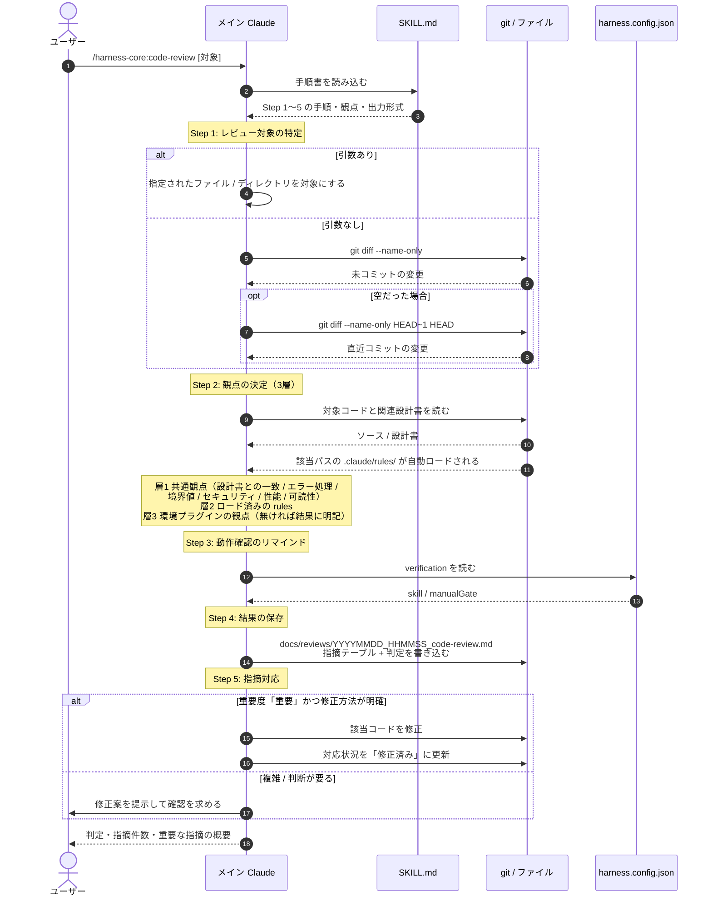

# スキル実行シーケンス図 — `/harness-core:code-review` の内部

| 項目 | 内容 |
|------|------|
| 対応ハーネス版 | harness-core 0.2.3 / harness-nextjs 0.1.2 / harness-unity 0.2.0 / harness-wpf 0.1.0 |
| 最終更新 | 2026-08-15 |

スキルを1本呼んでから結果が返るまでに何が起きるかを、`/harness-core:code-review` を例に示す図。
**[役割比較図](03_役割比較図.md) で整理した「スキル」の具体例**にあたる（要素間の違いはそちらを参照）。

**ポイント**:
- スキルの実体は **`SKILL.md` という手順書**。読み込まれたメイン Claude が、その順に自分で進める
- **`.claude/rules/` は手動で読まない。** 対象ファイルを読んだ時点で paths 条件により自動ロードされる
- **観点は3層で、毎回全部は見ない。** 共通観点 + プロジェクトの rules + 環境プラグインの観点を、変更内容に応じて使う

## 図の構成

### アクター（5者）

| アクター | 役割 |
|---------|------|
| **ユーザー** | `/harness-core:code-review` を呼ぶ人 |
| **メイン Claude** | 手順書を読んで実行する本体。**このスキルは最後まで同じ文脈で進む** |
| **SKILL.md** | `plugins/harness-core/skills/code-review/SKILL.md`。手順・観点・出力形式の定義 |
| **git / ファイル** | 変更ファイルの特定、対象コードと設計書の読み取り、レビュー結果の保存先 |
| **harness.config.json** | `verification` を持つ設定契約。**動作確認の案内先を決める** |

## 図



## 読み方

| ステップ | 意味 |
|---------|------|
| ①〜③ | スキルの起動は**手順書の読み込み**。別の Claude は起動しない |
| ④〜⑧ | 対象の特定。引数が無ければ**未コミット → 直近コミット**の順に探す |
| ⑨〜⑪ | コードと設計書を読む。**⑪ が要点** — `.claude/rules/` は読みに行くのではなく、該当パスを読んだ時点で**勝手にロードされる** |
| ⑫ | 3層の観点。**環境プラグインが無い場合は層1・層2 だけで実施し、その旨を結果に書く**（黙って省略しない） |
| ⑬〜⑭ | 動作確認の案内は `verification` 次第。`skill` が非 null ならそのスキル名を案内し、`manualGate` が true なら人手確認が必須である旨を添える |
| ⑮ | **結果はファイルに残す。** 会話に流すだけにしない |
| ⑯〜⑱ | 「重要」で明確なものは**その場で直す**。判断が要るものはユーザーに投げる |
| 最後 | ユーザーへの報告は**判定・件数・重要な指摘の概要だけ**。「良かった点」の列挙はしない |

## 他のスキルとの違い

`code-review` は**メインの文脈だけで完結する**タイプ。一方、**サブエージェントを起動するスキル**もある。

| スキル | サブエージェント | 起動のしかた |
|--------|----------------|------------|
| `/harness-core:code-review` | **起動しない** | メインが最後まで実行する |
| `/harness-core:design-review feature` | `code-reviewer` ＋ **体験系アドバイザー**（`product-advisor` / `game-designer` 等）を**並列**起動 | 環境プラグインが提供する場合のみ2本目が動く。無ければ1本で実施し、その旨を明記する |
| `/harness-core:design-review tech` | `code-reviewer` のみ | Stage 2 の技術設計を対象にする |
| `/harness-nextjs:browser-test` | `browser-tester` | Playwright MCP 経由で実操作する |

> 起動するかどうかで**文脈の扱いが変わる**（メインの履歴を引き継ぐか、要約だけが返るか）。
> その違いは [役割比較図](03_役割比較図.md) にまとめてある。

### 並列起動したときの決まり

`design-review feature` のように2本を並列で走らせる場合の扱いが定義されている:

- 片方が失敗したら、**成功した側の結果でレポートを作り**、失敗側は再実行を促す
- 両者の指摘が真逆（技術制約 vs 体験要求）のときは**自動解決せず「要判断」として明示する**

## この図が示している共通構造

どのスキルも次の形をとる。

```
手順書（SKILL.md）を読む → 対象を特定する → 設定契約（harness.config.json）を読む
  → 必要ならサブエージェントを起動する → 結果をファイルに保存する → 要約だけを報告する
```

**ファイルに残す**ことと**要約だけ返す**ことが共通しているのは、
会話の文脈は消えるが、ファイルは残るため。
フロー全体のどこでこのスキルが呼ばれるかは [開発フロー図](02_開発フロー図.md) を参照。
