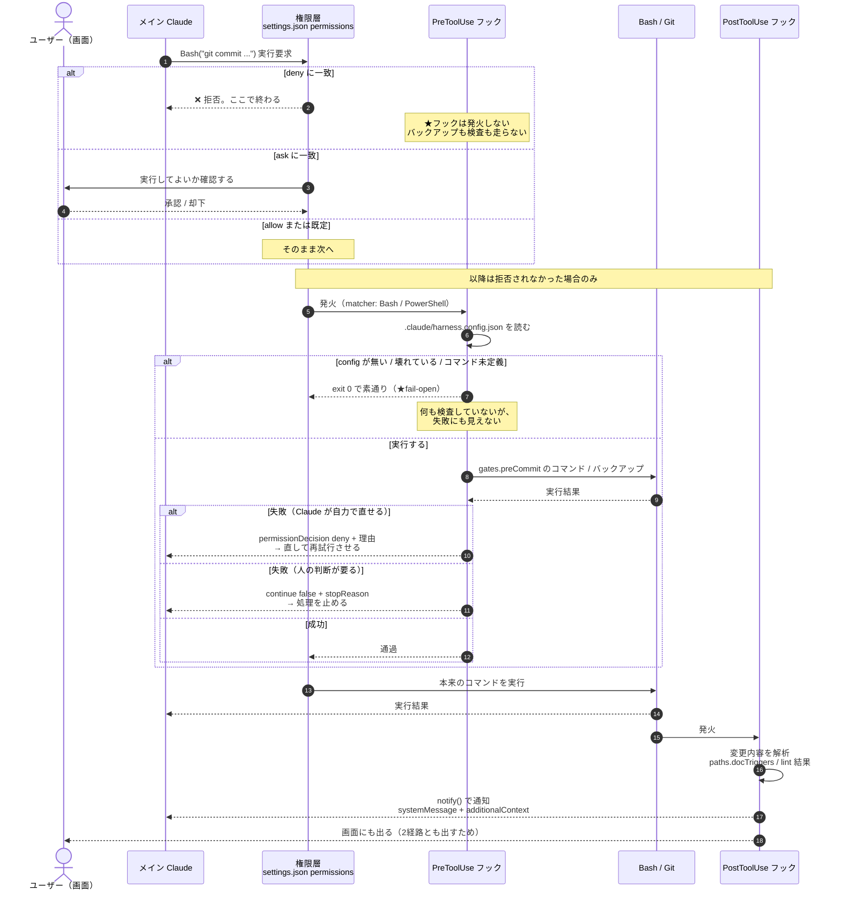

# フック発火タイミング図 — 誰が止め、誰に届くか

| 項目 | 内容 |
|------|------|
| 対応ハーネス版 | harness-core 0.7.0 / harness-nextjs 0.3.1 / harness-unity 0.2.1 / harness-wpf 0.2.0 |
| 最終更新 | 2026-08-16 |

フックがいつ発火し、**どこで止まり、結果が誰に届くのか**を示す図。

**ポイント**:
- **権限層はフックより手前にある。** `deny` で拒否された操作では、**フックが発火する機会そのものが無い**（C1 2周目の実測。`pre-migrate-backup` が動かず `.bak` が1つも増えなかった）
- **フックは設定が無ければ黙って素通りする**（fail-open）。止まらないのではなく、**そもそも何もしていない**
- **発火しても届くとは限らない。** 通知は`systemMessage`（画面）と`additionalContext`（Claude の文脈）の**2経路とも出す**のが既定。ただし **SubagentStop だけはどちらも届かない**（実測）

## 図の構成

### アクター（6者）

| アクター | 役割 |
|---------|------|
| **ユーザー（画面）** | `ask` の確認に答える人。**2経路とも出していれば通知が届く**（SubagentStop を除く） |
| **メイン Claude** | ツールの実行を要求する主体 |
| **権限層** | `.claude/settings.json` の `permissions`（`deny` / `ask` / `allow`）。**フックより手前** |
| **PreToolUse フック** | `pre-commit-check`（core）/ `pre-migrate-backup`（nextjs）。**ブロックできる** |
| **Bash / Git** | 実際のコマンド実行 |
| **PostToolUse フック** | `post-commit-doc-check` / `post-branch-notice`（core）/ `post-edit-lint`（nextjs）。**通知のみ** |

## 図

## 読み方

| ステップ | 意味 |
|---------|------|
| ①〜② | **最初に効くのは権限層。** フックではない |
| ②（deny 分岐） | `deny` は**セッション中の承認では緩められない**。ここで終わるため、後段のフックは一切動かない |
| ②（ask 分岐） | ユーザーの承認を挟む。**承認 + フックの二段構え**が現在の `prisma migrate` の設計 |
| ⑤〜⑥ | フックはまず**設定契約を読む**。環境を決め打たず `harness.config.json` に従う |
| ⑦（fail-open） | config 不在・パース失敗・コマンド未定義は **`exit 0` で素通り**。**失敗として表面化しない**ので、「動いているつもりで何もしていない」状態になりうる |
| ⑨〜⑪ | ブロックの強さは2種類。**自己修復できる失敗は `deny`**（Claude が直して再試行）、**人の判断が要る失敗は `continue: false`**（止める） |
| ⑬〜⑮ | PostToolUse は**止められない**。解析して通知するだけ |
| ⑯〜⑰ | **通知は2経路とも出す。** Claude の文脈にも、ユーザーの画面にも届く（次節）。**SubagentStop だけは例外**で、どちらにも届かない |

## 通知の届き方（イベント横断の実測・2026-08-15）

**フックの挙動で最も誤解されやすいのがここ。** 返し方**とイベント**の組み合わせで届く相手が変わる。

### 返し方ごとの届き先

| 返し方 | Claude に届くか | ユーザーの画面に出るか | 現在使っている場所 |
|-------|---------------|---------------------|------------------|
| `permissionDecision: "deny"` + 理由 | ✅ | ✅ **ブロックとして見える** | `pre-commit-check` / `pre-commit-cs-check`（ゲート失敗時） |
| `continue: false` + `stopReason` | ✅ | ✅ **停止として見える** | `pre-migrate-backup`（バックアップ失敗時 / 対象テーブルが空のとき） |
| `systemMessage` | ✅ | ✅ **出る**（SubagentStop を除く） | `notify()` が出す2経路のうちの片方 |
| `hookSpecificOutput.additionalContext` | ✅ | ❌ 出ない | 同上のもう片方 |

### イベントごとの実測（Claude Code v2.1.232 / Windows）

| イベント | `systemMessage`（画面） | `additionalContext`（文脈） |
|---------|------------------------|---------------------------|
| SessionStart | ✅ | ✅ |
| PreToolUse | ✅ | ✅ |
| PostToolUse（Bash / Edit / Write / Task） | ✅ | ✅ |
| **SubagentStop** | ❌ | ❌ **親に届かない**。サブエージェント自身へ戻り、**停止をキャンセルしてループする** |

**したがって既定は「2経路とも出す」**（`lib.notify(hookEventName, message)`）。
片方だけでは必ず片側に届かないので、**どちらか一方に賭けない**。

### SubagentStop だけは通知できない

`subagent-stop-diff` は**通知せず記録だけ残し**、`pre-commit-check` が
**コミットしようとした瞬間**に読み出して通知へ添える（`.claude/.subagent-touch.json`）。

- 移設先として PostToolUse（`Task`）も検証した。画面には出るが、**サブエージェントが背景実行の場合、
  ツールが返った時点＝起動直後に発火する**ため「終了時点の変更ファイル数」には使えない
- **`additionalContext` は使ってはいけない**（ループする。実測 8回・42秒・23.7k トークン）

> ### ⚠️ 以前の記述は誤りだった（2026-08-15 訂正）
>
> C1 2周目は「`systemMessage` は PostToolUse では surface されない」と判断し、
> `post-commit-doc-check` / `post-edit-lint` を `additionalContext` へ移した。
> **同じ Claude Code v2.1.232 で `systemMessage` は出る。** バージョン差ではなく切り分けの誤りである
> （1点の観測から出力形式を原因と断定していた）。**移したことで画面から通知が消えていた**（#23）。

### 確認したいときは

| 知りたいこと | 方法 |
|------------|------|
| フックが発火したか | フックが行う副作用を見る（`tools/backup/` にファイルが増えたか、コミットがブロックされたか） |
| 何を返したか | スクリプトを直接実行する（`echo '{...}' \| node <script>` で JSON を確認できる） |
| そもそも設定されているか | `.claude/harness.config.json` の `gates` / `paths.docTriggers` を見る |

## 権限層とフック層の役割分担

`deny` を厚くすればするほど安全になるわけではない。**フックより手前で止めると、フックの安全網が外れる。**

| 層 | できること | できないこと |
|----|-----------|------------|
| **権限層（`deny`）** | 実行させない | 「今回だけ許可」ができない。**迂回を誘発する** |
| **権限層（`ask`）** | 人の承認を挟む | 承認後の安全確保はしない |
| **フック層** | バックアップ・検査を**必ず**行う。失敗ならブロックする | 権限層で止められた操作には**関与できない** |

### 実例: `prisma migrate reset`

| | 修正前 | 修正後 |
|--|-------|--------|
| 権限 | `deny("Bash(*prisma migrate reset*)")` | **deny を削除**。`ask("Bash(*prisma migrate*)")` が覆う |
| 実際の動作 | ❌ 拒否のみ。**`pre-migrate-backup` が発火せず、バックアップが取られない** | ✅ ユーザーが承認 → **フックがバックアップを取ってから** migrate が走る |
| 副作用 | ハーネス自身の手順（設計書が `migrate reset` を指示）と衝突。`rm` で DB を消す**迂回案**が提示された | 手順どおり進められる |

> **安全側に倒したつもりが安全性を損なっていた**型の不具合。
> 同型の実例（`Write(path)` の deny が効かない / `.env*` が `.env.example` を巻き込む）は
> [permissionsベースライン.md §5](../permissionsベースライン.md) にまとめてある
> （発覚の経緯は ProjectTemplete `docs/reviews/20260814_permissions実機検証と発覚事項.md`）。

## フック一覧（発火点と止められるか）

| フック | イベント | 発火条件 | 止められるか |
|-------|---------|---------|------------|
| `session-start-context` | SessionStart | 起動 / resume / clear / compact | ❌ 通知のみ |
| `pre-commit-check` | PreToolUse | `Bash` / `PowerShell` のうち git commit と判定したもの | ✅ `deny` |
| `pre-migrate-backup`（nextjs） | PreToolUse | migrate 系コマンドと判定したもの | ✅ `continue: false`（**判定できないときは警告して通す** → 下記） |
| `post-commit-doc-check` | PostToolUse | コミット成立後 | ❌ 通知のみ |
| `post-branch-notice` | PostToolUse | **ブランチ作成コマンドの成功後**（`checkout -b` / `switch -c` / `branch <名前>` / `worktree add -b`） | ❌ 通知のみ（→ 下記） |
| `post-edit-lint`（nextjs） | PostToolUse | `Edit` / `Write` の後（対象拡張子のみ） | ❌ 通知のみ（**lint の自動修正は行う**） |
| `pre-commit-cs-check`（unity） | PreToolUse | `Bash` / `PowerShell` のうち git commit と判定したもの | ✅ |
| `subagent-stop-diff` | SubagentStop | サブエージェント終了時 | ❌ **通知できない**。記録を残し `pre-commit-check` が合流させる |

### 勝手に作られるブランチを見えるようにする（harness-core 0.7.0 以降）

Claude Code の既定方針は「**デフォルトブランチ上ならまず切る**」であり、
エージェントはコミット直前に**自動でブランチを作る**。分岐そのものは妥当だが、
**作成が報告に出ない**ため、ユーザーが知らないブランチに作業が積み上がる。

**実測（2026-08-16）**: skillup_mock で `chore/prune-design-policy-docs` に
**4コミットが約20時間気づかれずに残っていた**（作成から**20秒後**に最初のコミット
＝ 人が計画して切ったのではなく、コミットの流れで機械的に切られている）。

| 層 | 対策 |
|----|------|
| **フック** | `post-branch-notice` が作成直後に**画面と文脈の両方**へ出す。**止めない**（分岐は妥当な運用で、問題は黙っていること） |
| **セッション開始** | `session-start-context` が「**push されていないブランチの上にいる**」ことを**画面にも**出す |
| **規約** | `CLAUDE.md`「運用ルール」に**完了報告へ1行入れる**義務を明記 |

> **`session-start-context` には穴があった。** 未プッシュ数を `@{upstream}..HEAD` だけで数えており、
> **upstream が無いブランチでは行ごと消えていた**。
> **エージェントが自動で切ったブランチには upstream が無い**ため、
> **最も知らせるべき状況でだけ通知が黙る**という、H16 と同型の失敗だった。
> 0.7.0 で `origin/HEAD` を基準にしたフォールバックを入れている。

### 「判定できない」を黙って通さない（harness-nextjs 0.3.1 以降）

`pre-migrate-backup` は `tools/export-to-sql.ts` のバックアップ対象一覧を**ソースから読んで**判定する。
既存プロジェクトから移行した場合、このツールが**プロジェクト側の実装**で変数名が違うことがある。

| 状況 | 挙動 |
|------|------|
| 対象一覧が**空** | ✅ **ブロックする**（`continue: false`）。空のダンプを「バックアップ済み」と誤認させない |
| 対象一覧に**中身がある** | 通す（バックアップを実行する） |
| **変数名が判定できない** | **通すが `systemMessage` で警告する**。「チェックが行われていない」ことを明示する |

> ⚠️ **0.3.1 未満は3つ目のケースで黙って通していた。**
> `CLAUDE.md` が「未設定なら migrate をブロックする」と謳っていても、
> **そのプロジェクトでは機構が無効なまま**という状態が起きる（実測で2年近く続いていた）。
>
> **安全機構の fail-open は、黙ってはいけない。** 「判定できないので通す」自体は妥当だが、
> **通したことを誰にも伝えないと、効いていると誤認したまま運用が続く。**

発火判定は **matcher に頼らず、stdin の JSON（`tool_input.command`）を各スクリプトが自分で判定する**。
`*prisma migrate reset*` のような文字列一致は、**コミットメッセージ本文に含まれるだけで誤爆する**ため採らない。

各要素の役割の違いは [役割比較図](03_役割比較図.md)、
フックがフロー全体のどこで効くかは [開発フロー図](02_開発フロー図.md) の★ゲート4 を参照。
