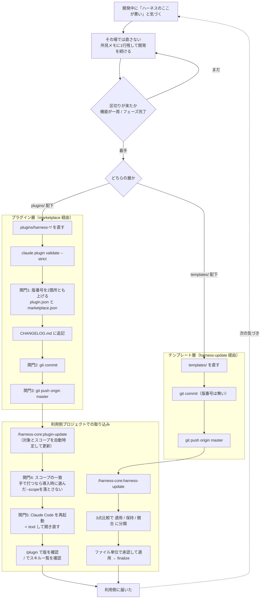

# 改善還元フロー図 — 気づきが利用側に届くまで

| 項目 | 内容 |
|------|------|
| 対応ハーネス版 | harness-core 0.9.1 / harness-nextjs 0.4.0 / harness-unity 0.3.0 / harness-wpf 0.3.0 |
| 最終更新 | 2026-08-16 |

プロジェクトの開発中に「ハーネスのここが悪い」と気づいてから、その修正が**利用側のセッションで実際に動き出す**までの流れを示す図。
`constitution.md` §8「改善はコアへ還元する」を実行したとき、途中で**黙って止まる箇所**がどこかを1枚にしている。

**ポイント**:
- **「直した」と「配信された」は別物。** 間に**版番号・コミット・push・update・再起動の5つの関門**があり、どれも失敗を報告せずに止まる
- **反映のトリガーは版番号の変化。** 中身だけ変えて push しても、利用側の `plugin update` は `already at the latest version` と言って何もしない
- **プラグイン層とテンプレート層は配信経路が別。** `plugin update` では `CLAUDE.md` も `.claude/rules/` も届かない（`/harness-core:harness-update` が要る）

> この図は実際に踏んだ事故の再発防止のために作られている。
> C1（初回ドッグフーディング）で「✅ 還元済み」と記録されていた3件が、実際には
> **作業ツリーに未コミットのまま**で、利用側には**1件も届いていなかった**（関門2 で停止していた）。

## 図の構成

### アクター（5者）

| アクター | 役割 |
|---------|------|
| **利用側プロジェクト** | 気づきが生まれる場所。その場では直さず**所見メモに1行残して開発を続ける**（`constitution.md` §8） |
| **開発者** | 区切り（機能が一周した / フェーズ完了）で、溜まった所見をまとめて直す人 |
| **claude-dev-harness** | 単一ソース。`plugins/`（プラグイン層）と `templates/`（テンプレート層）の**2層**を持つ |
| **GitHub / marketplace `dev-harness`** | 配信経路。**`version` が変わったときだけ**更新が起きる |
| **プラグインキャッシュ** | `~/.claude/plugins/cache/...`。実際に読まれる実体で、**セッション起動時に読み込まれる**（＝再起動が要る理由） |

### 2つの配信経路

| 層 | 何が入るか | 配信経路 | 版番号 |
|----|-----------|---------|--------|
| **プラグイン層** | `plugins/harness-*/` の skills / agents / hooks | marketplace →`claude plugin update` | **あり**（上げないと届かない） |
| **テンプレート層** | `CLAUDE.md` / `constitution.md` / `.claude/rules/` / `.claude/harness.config.json` / 設計方針層の骨格 / `docs/` 骨格 | `/harness-core:harness-update` の3点比較 | なし |

> どちらの層かは置き場所で見分ける。**`plugins/` 配下ならプラグイン、`templates/` 配下ならテンプレート層。**

### 還元にはもう1種類ある: ③→② の昇格

プロジェクト側の**設計方針**（`.claude/01_development_docs/` 等）に書いた規約が、
**同じ環境の別プロジェクトにもそのまま貼れる**と分かったら、それは環境共通の規約である。
この場合はプロジェクトに置いたままにせず、**ハーネスの `templates/<env>/.claude/rules/` へ昇格させる**
（constitution §8 の還元と同じ流れ。判定基準は「別プロジェクトに貼れるか」の一点）。

| 種別 | 気づく場所 | 還元先 |
|------|-----------|--------|
| ハーネスの不具合・改善 | 使っていて不便に感じたとき | `plugins/` または `templates/` |
| **③→② の昇格** | 設計方針を書いていて「これは他でも同じだ」と気づいたとき | `templates/<env>/.claude/rules/` |

> 昇格を怠ると、同じ規約を各プロジェクトが個別に育てることになり、**統合前の3テンプレートと同じ分裂**が起きる。

## 図



## 読み方

| ステップ | 意味 |
|---------|------|
| A → B | **気づいた時点では直さない。** メモに1行残して本業を進める。細かい改善で毎回プラグインを往復すると開発が止まる |
| B → C | 区切りまで溜める。**まとめて見た方が共通の原因が見え、根本的な直し方を選べる** |
| D | 直す対象の置き場所で経路が決まる。ここを取り違えると「直したのに届かない」が起きる |
| P1〜P4 | ソースを直し、マニフェストを検証し、**版番号を2箇所とも上げ**、CHANGELOG に残す |
| P5・P6 | コミットして push。**ここまでは利用側に何の変化も無い** |
| U1〜U3 | 利用側が marketplace を更新 → プラグインを更新 → **再起動**。この3手は利用側の操作であり、自動では起きない |
| U4 | 届いたことの確認。`/plugin` の**バージョン表示**と `/` のスキル一覧で判断する |
| T1〜T3 → W1〜W3 | テンプレート層は版番号を持たないが、**利用側で `/harness-core:harness-update` を回すまで届かない**点は同じ |

## 5つの関門 — 止まったときの症状と確認方法

**いずれも「エラーが出ずに何も起きない」形で止まる。** これが事故になりやすい理由。

| 関門 | 止まったときの症状 | 確認方法 |
|------|------------------|---------|
| **1. 版番号** | 利用側の `plugin update` が `already at the latest version` と表示して**何もしない**。「push したのに直らない」の原因はほぼこれ | `plugins/harness-core/.claude-plugin/plugin.json` と `.claude-plugin/marketplace.json` の**両方**が上がっているか。`claude plugin validate --strict` |
| **2. コミット** | 手元では直っているのに push するものが無い。**C1 で実際に踏んだのがこれ** | `git status`（作業ツリーに残っていないか） |
| **3. push** | marketplace は GitHub を見るため、手元だけが新しい状態になる | `git log origin/master..HEAD` / `/harness-core:pre-push-check` |
| **4. update のスコープ** | 導入時に選んだ方と違うスコープを更新してしまい、**セッションがどちらに解決するかで読み込まれる版が変わる** | 下記のワンライナーで `user` / `project` の版を突き合わせる |
| **5. 再起動** | キャッシュはセッション起動時に読まれるため、**セッション中には反映されない** | 再起動後に `/plugin` の版表示を見る |

### 関門4 の確認（スコープごとの版）

**`/harness-core:plugin-update` を使えばこの関門は自動で越える。**
スキルが導入済みのプラグインとスコープを特定し、`user` と `project` の重複も検出して報告する。

手で確認する場合（プロジェクトのルートで実行する）:

```bash
node ~/.claude/plugins/marketplaces/dev-harness/plugins/harness-core/skills/plugin-update/scripts/plugin-versions.mjs
```

**スコープ（`user`/`project`）は導入する側が選ぶ**（[セットアップガイド§2-1](../guide/セットアップガイド.md#2-1-スコープの選び方)）。
`claude plugin update` は既定で `user` しか更新しないため、`project` を選んでいる場合は
`--scope project` を明示する。**両方のスコープに登録が残っている**（0.17.0以前に生成した
プロジェクトの`enabledPlugins`が自動生成した名残、または意図せず両方へ導入した場合）と、
更新が「プラグイン数 × スコープ数」になり取り残しが起きやすいので、**片方だけに揃える**
（`plugin-update`スキルが重複を検出して報告する）。

> **Windows の注意**: 起動元のシェルでパス表記が変わり（Git Bash は `d:\...`、VS Code の統合ターミナル等は `D:\...`）、
> **同じプロジェクトが `project` スコープに重複登録される**。片方だけ更新すると版が食い違う。
> 予防は起動元をプロジェクトごとに一つに揃えること。復旧は古い方を `installed_plugins.json` から削除する
> （次回起動時に現行版で作り直されるため消して問題ない）。

## 誤解しやすい点

| 誤解 | 実際 |
|------|------|
| 「marketplace を設定してあるからプラグインは自動で入る」 | **入らない。** `extraKnownMarketplaces` は marketplace の登録までしかしない。**初回は `claude plugin install` が必須**（`claude plugin marketplace add` は不要） |
| 「起動時の `[harness] ...` が出れば導入成功」 | **半分正しい。** harness-core 0.5.0 以降は1行だけ画面に出るので「出ない＝導入できていない」は言える。ただし**版が古いままでも出る**ので、確認は `/plugin` と `/` を正とする |
| 「フックが何も言わないから動いていない」 | **0.5.0 以降は通知を2経路とも出す**ため、言うことがあれば画面にも出る。黙っているのは「言うことが無い」か「**config が無くて素通りしている**」かのどちらか。**SubagentStop だけは通知経路そのものが無い**（→ [フック発火タイミング図](05_フック発火タイミング図.md)） |
| 「`plugin update` すれば CLAUDE.md も新しくなる」 | **ならない。** テンプレート層は配信経路が別。`/harness-core:harness-update` が要る |
| 「`harness-update` で競合が出た＝失敗」 | **設計どおり。** ローカル改変を無断で上書きしないための挙動。統合して解決すればよい |
| 「キャッシュを直接直せば早い」 | 次の `update` / 入れ直しで**黙って消える**。試すだけでもやらないこと |

## 開発中に手早く試したいとき

版を上げて push する前に手元で確認したい場合は、**版番号を据え置いたまま入れ直す**方法がある。

```bash
claude plugin uninstall harness-core@dev-harness --scope project
claude plugin install   harness-core@dev-harness --scope project
# → /exit して再起動
```

ただしこれは**手元だけの反映**であり、他プロジェクトには届かない。
**最終的には必ず関門1〜3（版番号 → コミット → push）を通す。**

手順の詳細は [プラグイン開発手順.md](../reference/プラグイン開発手順.md)、変更履歴は [CHANGELOG.md](../../CHANGELOG.md) を参照。
